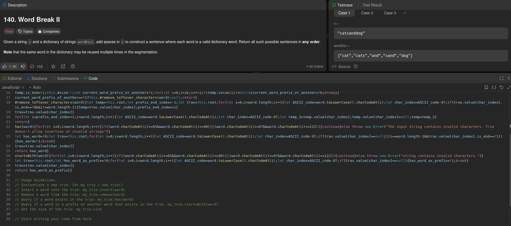

# GetJSDS_client

GetJSDS is an extension that fetches some commonly used data structures that are unavailable in Javascript from a server, and copies them to the clipboard. **It does not have access to read data from your clipboard.**

**Download link**

[Firefox browser AOM](https://addons.mozilla.org/addon/getjsds/)

**Screenshots**

 

**Supported data-structures in the current version**

- Queue
- Stack
- Priority Queue (Max)
- Trie

**Upcoming updates (tentative)**

- Addition on Union Find data-structure.
- Addition of Minimum Priority Queue.
- Support for google chrome browser (Manifest version 3.0).
